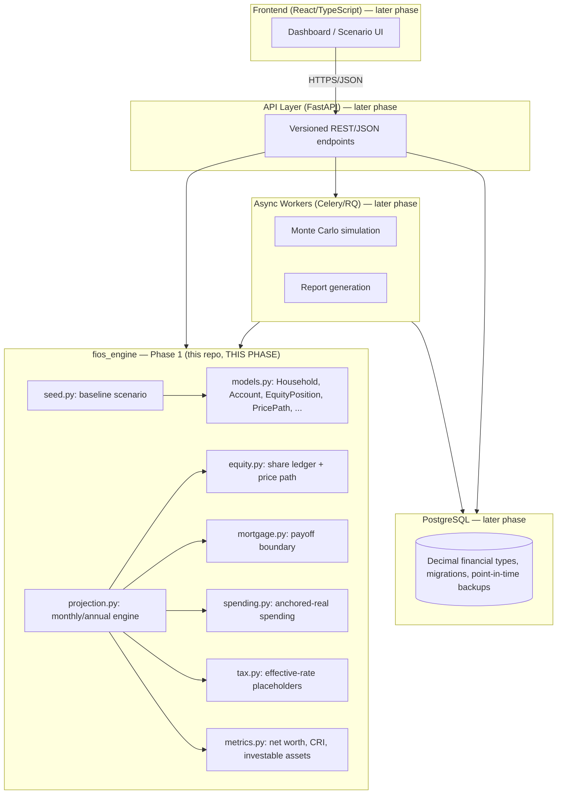

# FIOS Architecture

Status: Phase 1 (Core engine). Layers below the calculation engine (API, database, frontend, job
queue, auth) are designed here for context but not yet implemented — see `delivery-plan.md`.

## Layering

The calculation engine is a pure Python package with no dependency on the web framework, ORM, or
UI (PRD Section 16). It accepts a validated scenario object and returns a complete result object
(PRD Section 17).

## Calculation API Contract (PRD Section 17)

**Minimum engine input**: household profile, opening balance sheet, income streams, expense
streams, equity positions and price paths, liquidity events, account rules, tax assumptions,
return assumptions, scenario configuration, terminal constraints.

**Minimum engine output**: period-by-period cash flow and balances, WOA, FID, SAS, Freedom
Margin, pass/fail tests, risk metrics, legacy values (informational), warnings, and a complete
calculation trace.

Phase 1 implements the input model and the period-by-period cash flow/balance output only. WOA,
FID, SAS, Freedom Margin, pass/fail tests, and Monte Carlo are Phase 2+.

## Why the engine is isolated

- **Testability**: pure functions over `Decimal` in/out, no I/O, so golden-file and property
  tests (PRD Section 20) run in milliseconds with no database or network.
- **Reuse**: the same engine will back the future web API, CLI tools, scheduled reports, and
  Excel/PDF exports (PRD Section 1) without modification.
- **Auditability**: every calculation is traceable to inputs and formulas (PRD Section 18)
  because the engine has no hidden state — it is scenario-in, result-out.

## Planned layers (not yet built)

| Layer | Recommendation | Notes |
|---|---|---|
| API | FastAPI | Wraps engine calls in versioned REST endpoints (Section 17.1) |
| Database | PostgreSQL | Persists Household/Scenario/ProjectionResult entities (Section 11) |
| Frontend | React/TypeScript | Dashboard, scenario comparison UI (Section 12, 13) |
| Jobs | Celery/RQ | Monte Carlo (Section 9) and report generation (Section 14) |
| Auth | Managed identity provider | MFA, RBAC (Section 15) |
