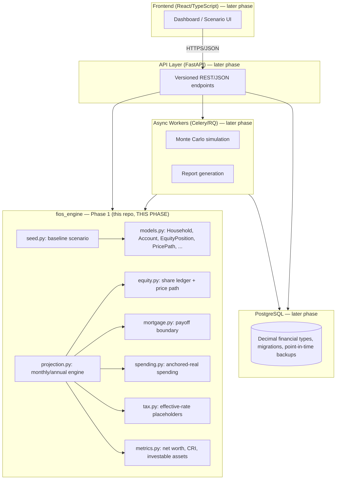

# FIOS Architecture

Status: Phase 1 (Core engine). Layers below the calculation engine (API, database, frontend, job
queue, auth) are designed here for context but not yet implemented — see `delivery-plan.md`.

## Layering

The calculation engine is a pure Python package with no dependency on the web framework, ORM, or
UI (PRD Section 16). It accepts a validated scenario object and returns a complete result object
(PRD Section 17).

## Calculation API Contract (PRD Section 17)

**Minimum engine input**: household profile, opening balance sheet, income streams, expense
streams, equity positions and price paths, liquidity events, account rules, tax assumptions,
return assumptions, scenario configuration, terminal constraints.

**Minimum engine output**: period-by-period cash flow and balances, WOA, FID, SAS, Freedom
Margin, pass/fail tests, risk metrics, legacy values (informational), warnings, and a complete
calculation trace.

Phase 1 implements the input model and the period-by-period cash flow/balance output only. WOA,
FID, SAS, Freedom Margin, pass/fail tests, and Monte Carlo are Phase 2+.

## Why the engine is isolated

- **Testability**: pure functions over `Decimal` in/out, no I/O, so golden-file and property
  tests (PRD Section 20) run in milliseconds with no database or network.
- **Reuse**: the same engine will back the future web API, CLI tools, scheduled reports, and
  Excel/PDF exports (PRD Section 1) without modification.
- **Auditability**: every calculation is traceable to inputs and formulas (PRD Section 18)
  because the engine has no hidden state — it is scenario-in, result-out.

## Planned layers

| Layer | Recommendation | Notes |
|---|---|---|
| API | FastAPI | **Minimal version built** (`api/fios_api`) -- wraps engine calls in Section 17.1's endpoints. No versioning, no DB, no auth yet; see below. |
| Database | PostgreSQL | Not built. `api/fios_api/store.py`'s `ScenarioStore` is an in-memory stand-in that loses state on restart -- explicitly not this layer. |
| Frontend | React/TypeScript | Not built. |
| Jobs | Celery/RQ | Not built. The minimal API runs Monte Carlo/reports synchronously in the request; fine for a prototype, not for production request latency. |
| Auth | Managed identity provider | Not built. The minimal API has no authentication, authorization, or session handling of any kind -- every endpoint is open. |

## Minimal API layer (`api/fios_api`)

A deliberately small FastAPI service wrapping `fios_engine`, built to make Section 17.1's
endpoints callable over HTTP without committing to the full stack above in one step (that
remains a separate, larger decision). Every endpoint delegates to an existing engine function
(`reporting.py`'s builders, `report_export.py`'s exporters, `dashboard.compute_dashboard_summary`,
`monte_carlo.run_monte_carlo`, `comparison.compare_scenarios`, `scenario_engine.clone_scenario`) --
no calculation logic lives in the API layer itself, matching "Reuse: the same engine will back
the future web API... without modification" above. `fios_engine/json_encoding.py`'s
`FiosJSONEncoder` keeps every JSON response exact (Decimal as string, never coerced through
float) rather than relying on FastAPI's own encoder, which would silently reintroduce the
float-rounding this engine avoids everywhere else.

Explicitly out of scope for this minimal version, by design: real persistence (`ScenarioStore` is
in-memory only, reset on restart), authentication of any kind, request versioning, async job
queues for long-running Monte Carlo/report calls, and a schema for arbitrary user-submitted
scenarios (the store only holds the seeded baseline and its built-in variants plus whatever a
caller clones at runtime).
