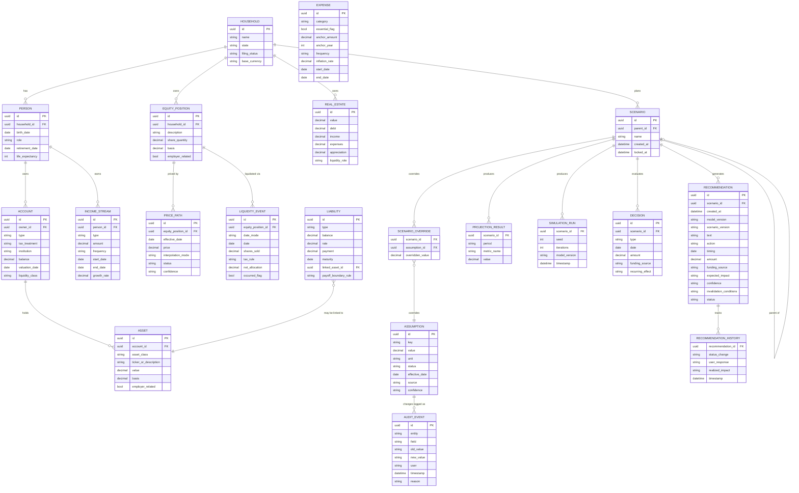

# FIOS Entity-Relationship Diagram

Covers every entity from PRD Section 11. Phase 1 implements these as in-memory Python objects
(`fios_engine/models.py`); the relational schema below is the target for the future persistence
layer (Phase 3+).

## Notes

- `EQUITY_POSITION` is the sole source of truth for company-equity value: value is always
  `share_quantity × PRICE_PATH.price` at a given date. No `value` column exists on
  `EQUITY_POSITION` itself (PRD Appendix B / CR-001) — this is enforced in Phase 1 by the Python
  model simply not exposing a settable dollar-value field.
- `LIQUIDITY_EVENT.date_mode` is `fixed` or `retirement_linked`; a `retirement_linked` event's
  effective date resolves to the scenario's candidate retirement date at evaluation time
  (CR-005), so it has no fixed `date` until it either occurs or is overridden.
- `ASSUMPTION.status` takes the four values from Section 4/27: `confirmed`, `assumption`,
  `placeholder`, `derived` (Phase 1 also allows `estimated` per Section 27's five-way status).
- Phase 1 does not implement `SCENARIO_OVERRIDE`, `PROJECTION_RESULT` persistence,
  `SIMULATION_RUN`, `DECISION`, `RECOMMENDATION`, `RECOMMENDATION_HISTORY`, or `AUDIT_EVENT` — the
  in-memory engine returns a result object instead of writing rows. These entities are shown here
  because they're required for the target Phase 3+ persistence layer.
