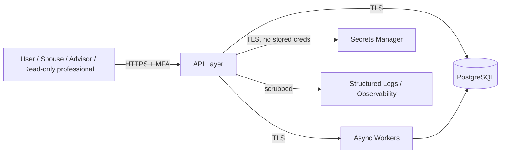

# FIOS Threat Model

Status: Phase 1 has no network, database, or auth surface — it is an in-process Python library.
This document threat-models the target system (PRD Section 15) so security requirements are
designed in from the start rather than retrofitted; most mitigations below become relevant
starting at the API/database phases (Phase 3+ per `delivery-plan.md`).

## Assets to protect

- Household financial data: balances, income, private-company share counts and pricing, tax
  details, real-estate values, spending patterns.
- Derived planning outputs: WOA, net worth, recommendations (reveal the above by inference).
- Credentials/session tokens (never account passwords or brokerage credentials themselves —
  those must never be stored, Section 15).
- Audit log integrity (immutable record of who changed what financial fact and why).

## Trust boundaries

Every arrow crossing a boundary is a place data can leak or be tampered with.

## STRIDE Summary

| Threat | Scenario | Mitigation (Section 15) |
|---|---|---|
| **Spoofing** | Attacker impersonates the household owner or an advisor role | MFA on all accounts; managed identity provider; role-based access (owner/spouse/advisor/read-only) |
| **Tampering** | Balances or assumptions silently altered | Immutable audit log (entity, field, old/new value, user, timestamp, reason) on every financial-data write; decimal types + migrations prevent silent precision loss |
| **Repudiation** | User denies making a change that affected WOA | Every assumption change requires effective date, old/new value, source, reason, user, timestamp (Section 28); audit log is append-only |
| **Information Disclosure** | Balances/tax data leak via logs, backups, or over-broad read access | No sensitive values in logs (Section 15, 16); encryption in transit and at rest; encrypted, versioned, restoration-tested backups; read-only professional role scoped to relevant data only |
| **Denial of Service** | Monte Carlo job floods worker queue; account lockout abuse | Background job queue with bounded concurrency (out of Phase 1 scope, tracked for Phase 4/8); session/device management to prevent credential-stuffing lockout amplification |
| **Elevation of Privilege** | Read-only professional role escapes to write access; advisor account edits another household | Role-based access control enforced at API layer, not just UI; per-household row scoping in the database layer |

## Specific controls carried into design now (even though unimplemented)

- **No standalone equity valuation input** (Appendix B / CR-001): reduces the risk of an
  inconsistent, manually-entered "shadow" valuation diverging from the audited share ledger —
  designed as a data-integrity control as much as a UX one.
- **Decimal-only financial types** (Section 11): prevents floating-point rounding from silently
  corrupting balances, which would otherwise look like a tampering or integrity event during
  audit.
- **No credential/brokerage-password storage** (Section 15): the application's threat surface
  never includes third-party account credentials — a secrets manager holds only its own API keys.
- **Full data export and permanent deletion** (Section 15): required for the eventual GDPR/CCPA-
  style right-to-delete and for closing out the audit trail cleanly when a household exits.

## Explicitly deferred (tracked, not designed yet)

- Concrete IdP choice and MFA enrollment flow (Phase 8 / API phase).
- Secrets-manager product selection and key-rotation policy.
- Backup encryption key management and restoration-test cadence.
- Detailed session-timeout duration and device-management UX.

These require an architectural decision once the API/auth layer is built and should not be
guessed at during the core-engine phase.
